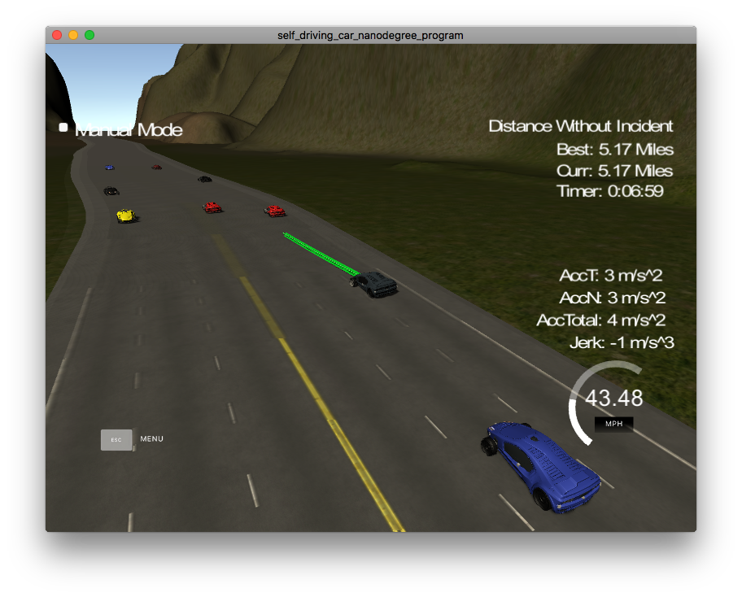

# Model Documentation

In this project, the model calculates costs using each state parameters, and is drive the car with the trajectory of the state having lowest cost.

## Trajectory

Generating trajectory is also executed as follows.(vehicle.h L37, getTrajectory())

1. Add the last two coordinates of previously generated trajectory to the lists of ptsx and ptsy. (L49-72)
2. Compute the coordinate added 30, 60 and 90 to current position using getXY(), and add three coordinates to the lists of ptsx and ptsy. (L74-84)
3. Using spline, ptsx and ptsy, approximate trajectory by cubic equation. (L96,97)
5. generate 30m of trajectory using cubic equation, and modify the gobal coordinate of trajectory to car's coordinate.

## State

State used the following five.

- Keep Lane(KL)
	- Do not move from the current lane.
- Lane Change Left(LCL)
	- Move from the current lane to the left one lane.
- Lane Change Left with velocity down(LCLd)
	- Move from the current lane to the left one lane, and same time, velocity down.
- Lane Change Right(LCR)
	- Move from the current lane to the right one lane.
- Lane Change Right with velocity down(LCRd)
	- Move from the current lane to the left one lane, and same time, velocity down.

In case of KL, velocity is set of as follows. (main.cpp L185-216)

- If the distance to forward vehicle is lower than 15m, add `-4/distance`(positive value) to velocity.
- If the distance to forward vehicle is 30m to 40m and velocity lower than 50 MPH speed limit, add `0.0224*distance - 0.896` to velocity.
- If the distance to forward vehicle is 40m to 50m and velocity lower than 50MPH and velocity higher than 40MPH lower speed limit, velocity is keep.
- If the distance to forward vehicle is 50m to 80m and velocity is between 50 MPH and 40MPH, add `(0.224/30)*distance - (5*0.224/3)` (negative value) to velocity.
- If the distance to forward vehicle is higher than 80m and velocity lower than 50, add velocity to `0.224`.
	- `2.24` is used when transform 1m/s to 1m/s. Then `0.224` is a value obtained by multiplying 0.1. 

## Cost

I used the following eight cost functions.(main.cpp)

- Collision with forward vehicle (L246)
- Collision with backward vehicle (L252)
- Lane changing (L160, 165, 171, 177)
- Speed violation (L263-265)
- Continuous deceleration (L219-233)
- Continuous lane changing (L273-283)
- Acceleration at collision (L268-270)
- Low speed penalty (L172,178)

### Cost of collision with vehicle
The cost of collisions is calculated by `getForwardCollisionCost()` and `getBackwardCollisionCost()`. Calculation process is described as below.

0. 自分自身のxy trajectoryをsd trajectoryに変換する
1. 現在の自分自身の車に最も近い前方の車をsensorfusion dataから取得する (L253)
2. 前方の車のsensorfusion dataに含まれるcar's x velocity, car's y velocityから速度と移動方向の向きを計算し、その車のシンプルなsd trajectoryを計算する。(L259)
3. 自分の車のtrajectoryと前方の車のtrajectoryを使って衝突する位置を取得
	4. 衝突位置の計算は、各trajectoryを後ろから見て、互いのway pointの差が20以下なら衝突として判定する
5. 6.5 / 衝突位置 * 1000 を衝突コストとする。また衝突しない場合は0になる

1. Convert generated xy trajectory to sd trajectory.
2. Search the closest car to current position using sensor fusion data.
3. Using `car's x velocity` and `car's y velocity` included sensor fusion data of the car, compute car's yaw. Then compute the sd coordinates using yaw and velocity, and generate a simple trajectory.
4. Get the position to collide with the trajectory of my car and the trajectory of forward car.
	5. In the calculation of the collision position, each trajectory is viewed from behind, and if the difference between the way points of each other is 20 or less, it is judged as a collision.
6. Calculate `6.5 / collision position * 1000` as collision cost. If there is no collision, cost becomes 0.

## Result
The car was able to drive more than 4.32 miles without incident.

